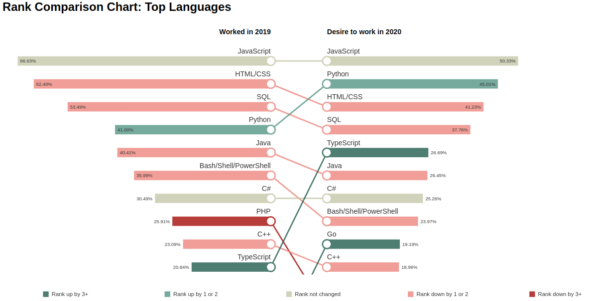

# Create a Rank Comparison Chart
This project creates an interactive rank comparison chart

## Table of Contents
<ol>
   <li><a href="#head1"> Description of the project</a>
   <li><a href="#head2"> Libraries used </a>
   <li><a href="#head3"> Directory structure </a>
   <li><a href="#head4"> Usage </a>
   <li><a href="#head5"> Author </a>
</ol>


<h2 id="head1"> Description of the project </h2>
Given JSON array of object with the following properties, it creates an interactive rank comparison chart:
<ul>
   <li>Name: Name of item being charted
   <li>Current: Value in Current Period
   <li>Next: Value in Next Period
</ul>

<h2 id="head2"> Libraries used </h2>

<ul>
 <li> d3.js
</ul>

<h2 id="head3"> Directory structure </h2>

```
.
├── data                                # Folder to hold data files
    ├── data.csv                        # Data for languages in CSV format
    ├── data.js                         # Data for languages in JSON format
    ├── data_database.csv               # Data for database enviorments in CSV format
    ├── data_database.js                # Data for database enviorments in JSON format 
    ├── data_platform.csv               # Data for platforms in CSV format
    ├── data_platform.js                # Data for platforms in JSON format 
    ├── data_webframe.csv               # Data for web frameworks in CSV format
    ├── data_webframe.js                # Data for web frameworks in JSON format 
    ├── data_dummy.csv                  # Dummy data to test in CSV format
    ├── data_dummy.js                   # Dummy data to test in JSON format 
├── js                                  # Folder to hold JS files
    ├── d3-v4.js                        # d3 v4 file
    ├── RankCompare.js                  # Main JS code for rank comparison chart creation
├── index.html                          # Index HTML file (creates comparison chart for Programming Languages)
├── database.html                       # Databases comparison chart HTML file
├── platform.html                       # Plaftforms comparison chart HTML file
├── webframe.html                       # Web Frameworks comparison chart HTML file
├── README.md                           # ReadMe file

```

<h2 id="head4"> Usage </h2>
In the HTML file:

1. Include d3 file
2. Include RankCompare.js file
3. Invoke RankCompare method with configuration object. Attributes of configuration object:
- divElement: D3 selection of the div element to hold the chart
- dataArr: Array of objects with 'Name', 'Current', and 'Next' attributes
- title: Title of the chart
- topN: Top entities to display in chart, even if data is present for more entities
- format: Format of 'Current' and 'Next' values
- leftTitle: Sub-Title for left side bar chart
- rightTitle: Sub-Title for right side bar chart

Below is an example invocation and generated chart:

```
RankCompare({'divElement': d3.select('#chart'), 
						'dataArr':data, 
						'title':"Rank Comparison Chart: Top Languages",
						'topN':10,
						'format':"percent",
						'leftTitle':"Worked in 2019",
						'rightTitle':"Desire to work in 2020"
						});
```


<h2 id="head5"> Author </h2>

[Shahzeb Akhtar](https://www.linkedin.com/in/shahzebakhtar/)
